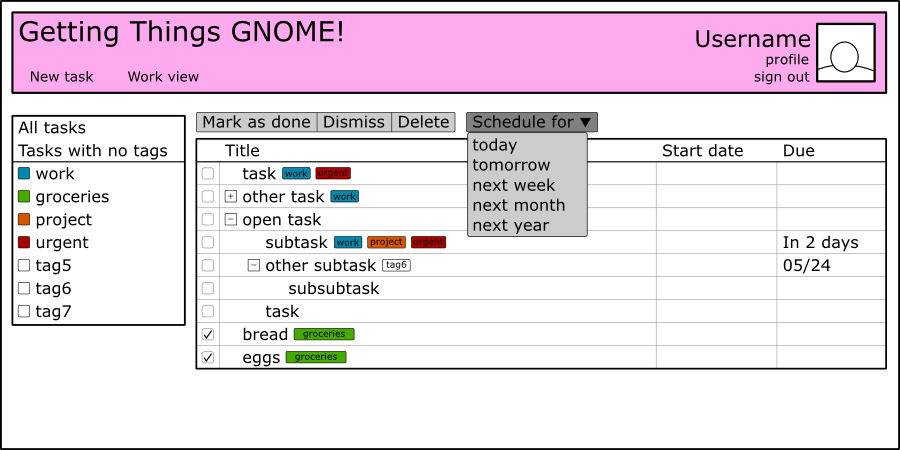

# Getting Things GNOME! Web Service and API

The goal of this project is to add Getting Things GNOME! (GTG) web
service and API similar to Snowy for Tomboy. This enables
synchronization between GTG installations and provides access to GTG
data on mobile and other desktop platforms.

A quick mockup of the interface:

## More Information

A more detailed explanation is [here](index).

## Reports on the project

- [Introduction](http://karlojez.wordpress.com/2010/05/23/getting-things-gnome-gsoc-introduction/)
- [Weekly Report 1](http://karlojez.wordpress.com/2010/05/28/getting-things-gnome-gsoc-weekly-report-1/)
- [Weekly Report 2](https://lists.launchpad.net/gtg-gsoc/msg00038.html)
- [Weekly Report 3](http://karlojez.wordpress.com/2010/06/11/getting-things-gnome-web-service-weekly-report-3/)
- [Weekly Report 4](http://karlojez.wordpress.com/2010/06/20/getting-things-gnome-web-service-and-api-weekly-report-04/)
- [Weekly Report 5](http://karlojez.wordpress.com/2010/06/27/gtg-web-the-fifth-report/)
- [Weekly Report 6](http://karlojez.wordpress.com/2010/07/05/gtg-web-the-halfway-report/)
- [Weekly Report 7](http://karlojez.wordpress.com/2010/07/11/gtg-web-report-007/)
- [Weekly Report 8](https://lists.launchpad.net/gtg-gsoc/msg00061.html)
- [Weekly Report 9](http://karlojez.wordpress.com/2010/07/24/gtg-web-report-9/)
- [Weekly Report 10](http://karlojez.wordpress.com/2010/07/30/getting-things-gnome-web-service-guadec-report/)
- [Weekly Report 11](http://karlojez.wordpress.com/2010/08/09/getting-things-gnome-web-the-penultimate-report/)
- [Weekly Report 12](http://karlojez.wordpress.com/2010/08/15/gtg-web-the-final-gsoc-report/)

## Future plans

Work on this project will continue after GSoC. Plenty of bug fixing,
feature adding and designing is yet to be done.

## Get the code

First, you should install django. There are packages for most linux
distributions. After installing django, you should get the code:

    bzr branch lp:~karlo-jez/gtg/gtgonline

There are two programs you need to run to use GTG web service. One is
the fake GTG server which serves tasks to the web interface using dbus,
the other is django http server

    cd gtgonline
    ./dbusserver/fakegtgserver.py

To use the fake GTG server, you should quit real (desktop) GTG if it is
running, because they both use the same dbus interface name and dbus
will recognize the one that was started first. Tasks in the fake server
disappear once you kill it. It is only to be used for testing, don't
make your to do lists with it.

In another terminal go to the same directory and execute:

    ./manage.py syncdb
    ./manage.py runserver

Syncdb will ask you to create a new account, do it! With that account
you will be able to log in to the service and the django admin interface
(to create new users) Go to <http://127.0.0.1:8000> and log in with the
previously created account. For the admin interface go to
<http://127.0.0.1:8000/admin/>.

## testing the API

First set up the server by following the instructions above. Perfect
tool for trying out the API is curl.

Planned API specification is here: [API spec.](index#api)

`curl "http://127.0.0.1:8000/api/1.0/username/"` returns user details:

    {
        "user-name": "username", 
        "first-name": "", 
        "last-name": "", 
        "tasks-ref": {
            "href": "http://127.0.0.1:8000/", 
            "api-ref": "http://127.0.0.1:8000/api/1.0/username/tasks/"
        }

`curl "http://127.0.0.1:8000/api/1.0/username/tasks/" -u username:password`

returns task list, without details:

    {
        "tasks": [
            {
                "ref": {
                    "href": "http://127.0.0.1:8000/task/t1-1", 
                    "api-ref": "http://127.0.0.1:8000/api/1.0/username/tasks/t1-1/"
                }, 
                "id": "1@1", 
                "title": "Make a fake GTG dbus server"
            }, 
            {
                "ref": {
                    "href": "http://127.0.0.1:8000/task/t2-1", 
                    "api-ref": "http://127.0.0.1:8000/api/1.0/username/tasks/t2-1/"
                }, 
                "id": "2@1", 
                "title": "Rest a bit before doing the server"
            }, 
        ...

`curl "http://127.0.0.1:8000/api/1.0/username/tasks/?include_content=True" -u username:password`

returns a full task list, with tags, parents, children and dates.

