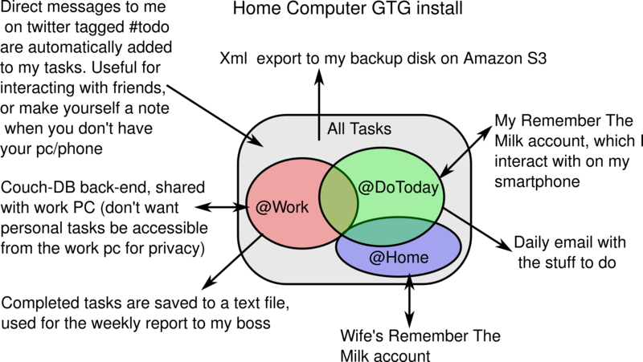
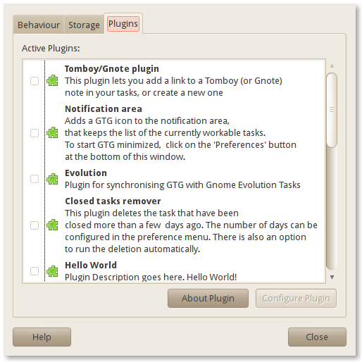

# Getting things GNOME! integration with online services

## Quick Info

### Abstract

Development of a framework to synchronize the TO-DO manager "Getting
Things GNOME!" with online (and offline) providers of "things to do".
Providers can range from traditional online TO-DO managers à la Remember
the Milk to bugs assigned to you in a bug tracker. A few of them will be
implemented: Remember the Milk, Evolution Data Server, Launchpad ,
twitter (for adding tasks when receiving direct messages marked #todo).

### User cases:''why would I need that?''

"Getting Things GNOME" (GTG) is a little software that helps you in
keeping track of the things you have to do. It's fairly young, but it's
becoming famous because it's easy to use and works quite well. It's main
limitation its that you have to use GTG to access the things you have to
do (a.k.a. tasks), and youcan't have GTG on your smartphone. So, let's
suppose that, as things are standing, you prefer to have a simple tasks
list on a piece of paper or a text file.

But would you use GTG if it could synchronize itself to some popular
TODO management website like Remember the Milk, with which you can
interact on your smartphone (there are apps for Android, IPhone...)? And
if you could share your tasks between your home and work computer via
Ubuntu One? Supposing you're a developer, what about having the bugs you
have to fix (assigned to you in different bug trackers) automatically
listed directly in your GTG?

And if you could tweet/dent yourself (or someone else) a task? If you
could share tasks marked @Home and @Errands with your wife, would you
consider using it? (no, your fridge cannot add "buy milk" tasks to your
GTG yet)

Now, what if it could automatically generate weekly a list of the stuff
you have done at work (tagged @Work) and upload it to google docs, so
that you could mail it to your boss? Does he prefer a text-only mail? A
pdf? Perhaps you'd like to see the stuff you have done in your Zeitgeist
Activity Journal. Wouldn't that be neat? I'm planning to lay out a
framework that enables GTG to support those things, and implement a few
of these services (namely, Remember the Milk, Evolution Data Server,
Launchpad , twitter and perhaps Couch-DB). Other services will come in
due time.

A quite complex configuration is showed in the next figure:

### Project context

[Luca Invernizzi](http://allievi.sssup.it/invernizzi)'s project for the
[Google Summer of Code](http://socghop.appspot.com/), 2010 edition.

### Timeline

- **April 27 - May 11**: Read completely the refactoring and go through the bug filed as regressions
- **May 12 - May 23**: Look into NetworkManager documentation. The SE should be notified if the connection is available or if it has been lost. See the pros and cons of the old SE implementation and discuss with the GTG team on how it could be improved. Look into the RTM api to use the last_sync parameter (in order to speed it up). Write a simple file-based backend for the current GTG, to get a feel on how that part of GTG works.
- **May 24 - June 7**: Write the UI to configure the modules.
- **June 8 - June 21**: Write the SE as a standalone module.
- **June 22 - July 5**: Integrate the SE into GTG. create the "tag pane" popup UI.
- **July 6 - July 12**: Convert the rtm and evolution plugins to the new system. If time remains, Expand the rtm plugin to support the rtm concept of lists.
- **July 13 - July 16**: Midterm time. Submit the code and talk with Lionel. I'll keep this time free in case I've fallen behind schedule.
- **July 17 - July 30**: Write the launchpad back-end and documentation on how to write a back-end
- **August 1 - August 9**: Write the twitter/identi.ca back-end.

**'What will be showable at mid-term?**

The core part of the project will be ready for mid-term (and GUADEC).
Also, the Evolution and RTM back-ends should be ready.

------------------------------------------------------------------------

## Extended Info: Implementation details

My proposal is composed of four parts:

1. A stand-alone synchronization engine (SE)
2. GTG integration and UI for the SE
3. Implementation of a few back-ends
4. Documentation

### Synchronization Engine

It appears that there isn't a generic SE written in python in FLOSS (or,
at least, I couldn't find one). Since I need one, and the overhead of
writing it in a generic way is very small, I'm planning to write it as a
standalone module. "Cloud" integration is becoming more and more
critical these days, so maybe this can be reused in some other project.

At a technical level, I'm planning to do this by creating a level of
abstraction. For that, I'll need two class prototypes,
GenericProxy and GenericSyncObject.

GenericProxy is used for interfacing with an on-line
service. It handles the authentication, the construction of a list of
GenericSyncObject objects corresponding to the
objects (for us, tasks) currently stored in the on-line service, the
creation and the deletion of an object. It's most important functions
will be:

- *authenticate()*
- *has_authenticated()*
- *generate_objects_list()*
- *add_object()*
- *delete_object()*

The GenericSyncObject class prototype is a
prototype for the objects that will be synced (in our case, tasks). It
supposes that all the objects are independent and they can be safely
copied without side effects. It defines the two methods, which are
needed by the SE:

- *copy()*: the current object must become a copy of another object.
  In our case, it will be used for tasks that have been modified
  (suppose that a task has been modified in GTG. If we want to push
  the changes to the remote back-end task, we would issue
  backendtask.copy(gtgtask) )
- *get_modified_datetime()*

In our case, we synchronize tasks. So, we will create a
GenericTasks class as a subclass of
GenericSyncObject. GenericTask
will define the getting and setting of all the task attributes. It will
have a series of methods, among which there are:

-   *get_title()*
-   *set_title()*
-   *...*

Now that we have hidden the particularity of the back-ends in those
classes, we can proceed to have a look into the generic SE work-flow.

The SE will:

1. be initialized with two objects derived from GenericProxy (e.g: RTMPRoxy and GTGProxy)
2. delegate authentication to the proxies
3. ask from each of the proxies for a list of GenericSyncObject objects
4. confront those lists with its previous knowledge of objects that are
   "linked" (meaning that they are the same object saved in two
   different back-ends). If no previous knowledge is found, one object
   attribute, provided upon instantiation of the SE class, will be used
   to decide which object should be linked (object with the same
   attribute value will be linked). In our case, we'll link the tasks
   that have the same title: this avoids task duplication in the event
   of the corruption of the saved "previous knowledge". This solution
   has proved effective with the current RTM plugin.
5. Figure out which objects have been deleted, and which are new, and
   synchronize them (deleting the corresponding object in the other
   Proxy, or creating a new one)
6. Take all the remaining objects and figure out which have been
   modified from the last sync. Copy those objects one over the other
   on a "last modified wins" basis.

Proprieties of the SE:

- The SE must be able to handle in a safe way faults and loss of
  connectivity.
- The SE should automatically perform full syncs every few minutes.
- The SE should be able to handle import only, export only and full
  sync back-ends. Twitter, for instance, it's import only, while a
  weekly report of completed tasks is export only.

I've been working and testing the implementation of such an SE with the
RTM and Evolution plug-ins, and I think I'm on a good track (this far, I
received no death threats about deleting all task of anybody, and I'm
aware that quite a number of our users are using the RTM plugin).

### GTG integration and UI

GTG already provides a basic level of abstraction that isolates the
details of task loading and storing from a back-end. Currently, the only
back-end implemented is a GTG-specific XML file. My SE will be
integrated just below that level of abstraction. This should be fairly
easy, as GTG code would be minimally modified. The most prominent thing
of this part of the work will be writing a UI to let the user easily
configure a back-end and associate some tags (and, optionally, all
tasks) to it. Some discussion on this has already been done. I am
proposing a two parts approach. Back-ends would be configured in GTG
preference window.

The "storage" tab, which is currently empty, will let the user enable
and change the configuration of a back-end just like the displayed
Plugin tab. This allows to maintain all the configurations in one
easily-findable place, and it's already in GTG plans. Although a few
interfaces have been discussed, I will follow the lines of our plugins
tab, in order to maintain a consistent UI (which is the same of gedit,
gnome-do and several other projects).

To create the tag-backend relationship, I will add an entry to the short
pop-up menu of the "tags pane". Something like this:

Clicking on that, the user will be presented to a simple checkbox list
of the currently configured back-ends. "Ticking" one of the boxes will
start synchronizing that the tasks associated with that tag with the
backend. Tasks associated with sub-tags (tags can be nested in GTG) of
that tag will also be synced. GTG already has a "All tasks" tag, so a
user can sync all tasks in a similar way.

Optionally, in order to allow a faster addition of a lot of tags to a
back-end, I can add a text box in the back-end configuration containing
the list of the tags that will be synced with that back-end. The user
can simply edit that field to add tags. Before doing that, however, I
will discuss this solution with the GTG team (I had this idea today, so
I haven't had the opportunity to propose it yet), most importantly with
Bertrand Rousseau, which has veto power on UI changes.

If the user is required to interact with a back-end for unforeseen
reasons (loss of authentication, for instance), I will display the
notification to the user using the GTKInfoBar class, which is
increasingly used in GNOME apps (Gedit and Nautilus come to mind)
because it's less intrusive than a popup but it still can't be missed.
This will also augment the UI consistency between GTG and the rest of
the GNOME Project

### Backend implementations

I'm planning to convert and expand the RTM and Evolution plugins to this
infrastructure, and implement from scratch an import-only backend for
Launchapad bugs using launchpadlib. If time remains, I'll add an
import-only twitter/identi.ca backend (using the python-twitter
library). If time still remains, I'd like to convert and finish the
support for Couch-DB (so, UbuntuOne support), and
implement a otherwise I'll do that in my free time after GSoC.

### Documentation

I think that easing the way for other developers to get busy with coding
is most important, so I will take some time to write an "how-to" guide
on writing a back-end, and post in in both GTG wiki and blog. Maybe that
will give the head start for some new back-ends!

