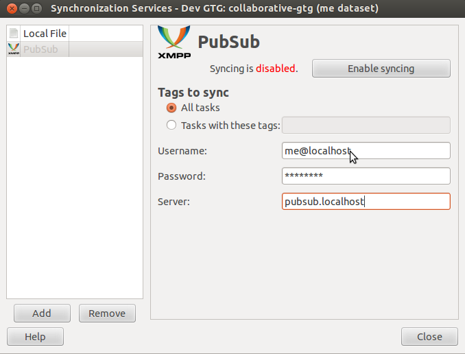
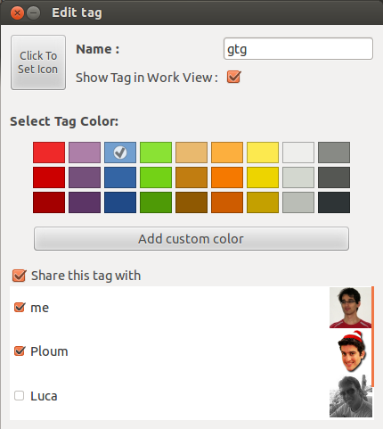
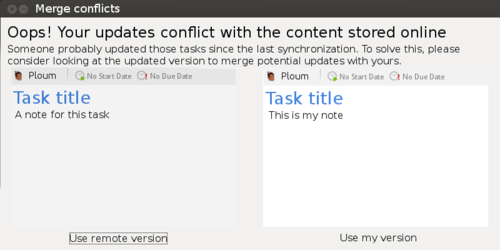

# Collaborative Getting Things GNOME!

GTG provides great user experience for individuals. I would like to
implement sharing tasks between users. GNOME will become the first
desktop with built-in task sharing. This would made it the desktop of
choice for small to medium businesses.

[Project page](http://www.google-melange.com/gsoc/project/google/gsoc2012/iyo/40003)
| [Full text of the proposal](http://www.google-melange.com/gsoc/proposal/review/google/gsoc2012/iyo/22003)
| [Code repository](https://code.launchpad.net/~izidor/gtg/collaborative-gtg)
| [How to setup server](pubsub-server)

## Contact information

E-mail: <izidor.matusov@gmail.com>  
IRC: Izidor in gimpnet (#gtg)  
Launchpad account: [izidor](https://launchpad.net/~izidor)  
Blog: [izidor.matusov.sk](http://izidor.matusov.sk/archive.html)  

## Reports

- [Week #01](https://mail.gnome.org/archives/gnome-soc-list/2012-May/msg00028.html)
- [Week #02](https://mail.gnome.org/archives/gnome-soc-list/2012-June/msg00002.html),
  [Collaborative GTG](http://izidor.matusov.sk/blog/collaborative-gtg.html) (blogpost)
- [Week #03 & #04](https://mail.gnome.org/archives/gnome-soc-list/2012-June/msg00004.html)
- [Mockups of Collaborative GTG](http://izidor.matusov.sk/blog/mockups-of-collaborative-gtg.html) (Week #05)
- [Contact widgets preview](http://izidor.matusov.sk/blog/contact-widgets.html) (Week #07)
- [See you at GUADEC](http://izidor.matusov.sk/blog/see-you-at-guadec.html) (Week #09)
- [Hot end of the summer](http://izidor.matusov.sk/blog/hot-end-of-summer.html) (Final report)

## How does it look like?

Configuration of a PubSub service:  

Sharing is configured per tag in the tag editor:  

Assigning tasks to teammates:  

Mockup for solving *merge conflicts* (not implemented yet):  

## Screencasts

- [First prototype of collaborative Getting Things GNOME!](http://youtu.be/cBTEJ1EYwQo)
- [Preview of contact widgets](http://youtu.be/kubHrKx1yj0)

## How to install it

1. [Setup XMPP server on your computer](pubsub-server)
2. Get needed code

       bzr branch lp:~izidor/gtg/collaborative-gtg
       git clone https://github.com/liblarch/liblarch
       sudo pip install sleekxmpp
3. Run it

       cd collaborative-gtg
       ./scripts/debug.sh

You can read detailed tutorial in [the final report](http://izidor.matusov.sk/blog/hot-end-of-summer.html).

## Known Issues

I would like to fix following issues in the following weeks:
- a GTG plugin for telepathy-gabble for PubSub
- test Collaborative GTG on various servers
- handle adding/removing people in the contact list, adding
  to/removing from project without restarting GTG
- figure out, why SleekXMPP takes so much time to shut down
- clean the code

