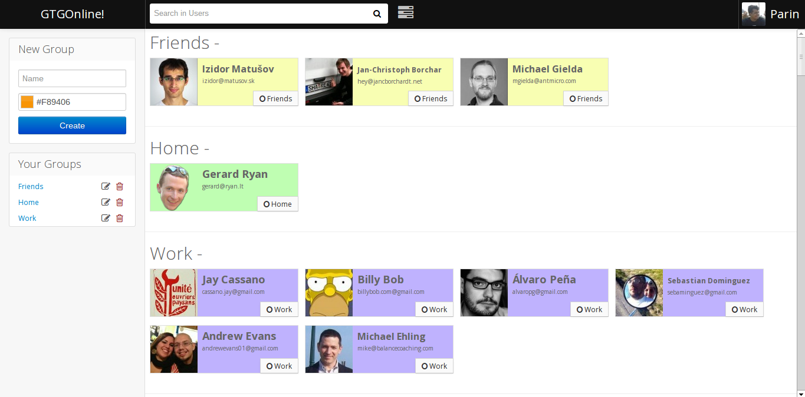
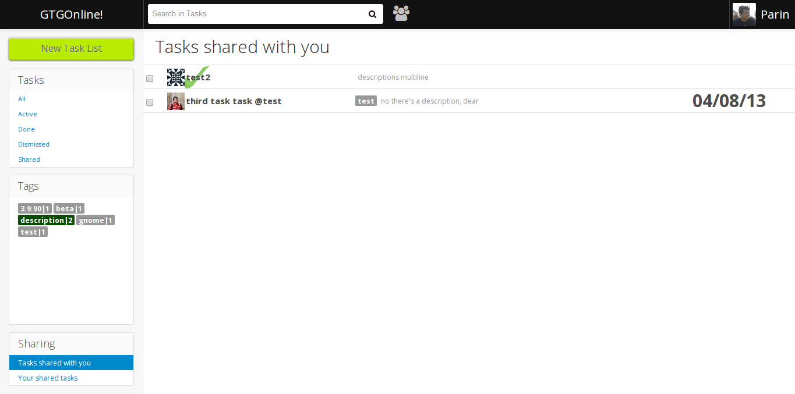
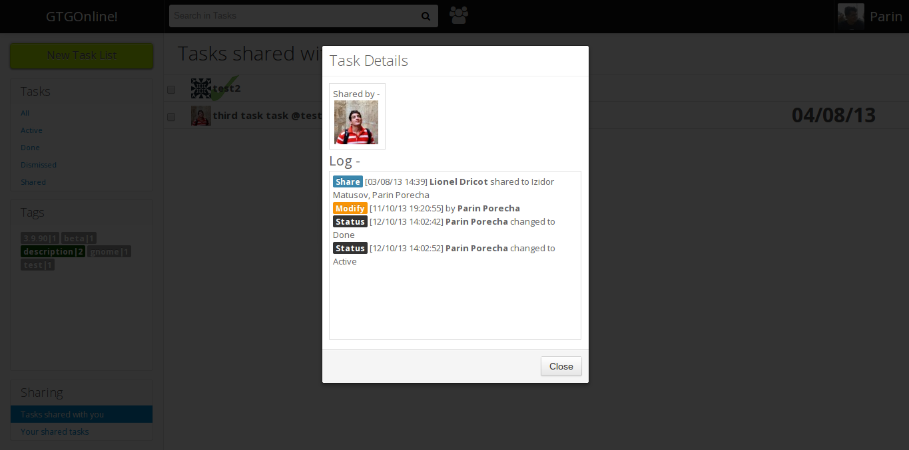
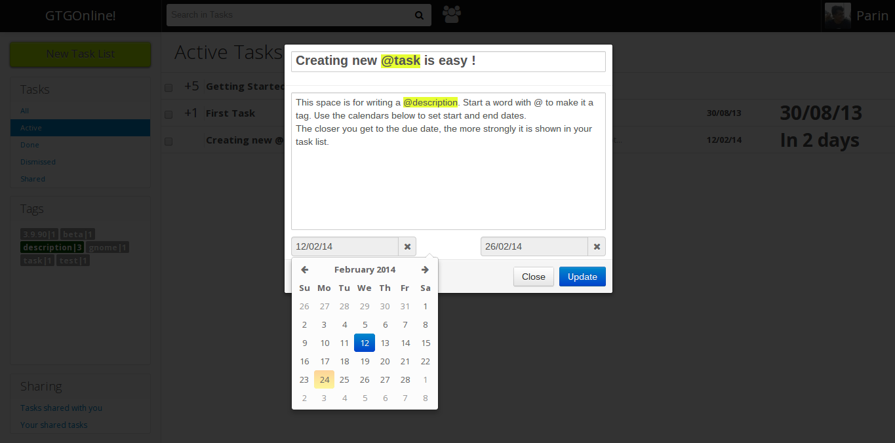

# A Web Application for Getting Things Gnome!

The application is currently deployed [here](http://gtgonline-parinporecha.rhcloud.com/user/landing/).

Or, you can view [these](http://imgur.com/a/NOKse#0) screenshots
showcasing the different features of GTGOnline!

> 
> Add users to your lists, share tasks with them and collaborate
>
> 
> The thumbnail of the user is displayed alongside task name to easily know who has shared the task with us
>
> 
> All the changes made to a task (Status, date, users add/remove etc.) are recorded and logged. You can view the log to know the full history of the task
>
> 

[Creating](creating.png) new tasks is made to work
like workflowy. You can create full task trees in GTGOnline!. Two
keywords - 'start:' and 'due:' are used to specify the start and due
dates. The rest controls are intuitive and displayed above the Task
Creator. GTGOnline! also supports Task Sharing. You can create groups (
On registering, 3 groups are created by default - 'Home', 'Friends', and
'Work' ), and add users to them. Then you can share your task/s with
them.

Choosing users to share task with is very flexible. You can either share
it with a group, and some users from other groups as well.

When a task is shared, a log of all the changes made will be created.
You can [view](view.png) all the modifications
made to that task till date (eg:- status change, edit etc.)

[Here](https://code.launchpad.net/~parinporecha/gtg/backend_gtgonline)'s
the link to the Launchpad branch containing the code for the backend
which synchronizes tasks between GTG and GTGOnline!
([screenshot](screenshot.png)) The work is being
reviewed by GTG developers

Link to github repo of the project - <https://github.com/parinporecha/GTGOnline>

# Blog reports

-   [Update #1](http://parinporecha.tumblr.com/post/53744420397/hello-everyone-i-am-a-soc-student-this-year-and)
-   [GUADEC Report](http://parinporecha.tumblr.com/post/58140272502/report-of-my-first-guadec)
-   [Update #2](http://parinporecha.tumblr.com/post/59599541750/gsoc-project-update)
-   [Status about sync backend](http://parinporecha.tumblr.com/post/61296063813/end-of-the-line-or-the-start)
-   [Final Report](http://parinporecha.tumblr.com/post/62350822700/gsoc-project-final-report)

