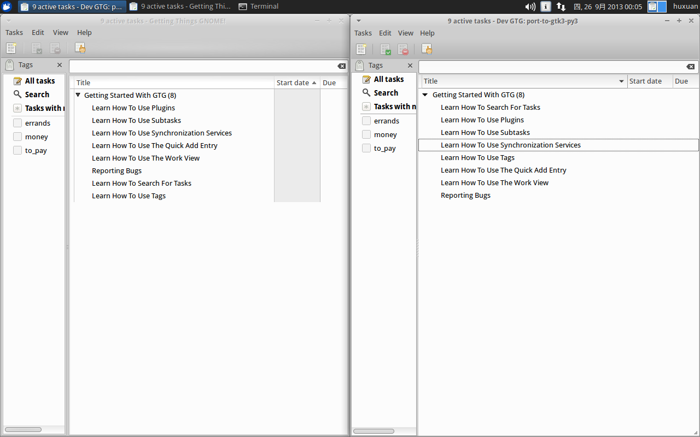

# Porting GTG and Liblarch to Gtk3 and Python3

- With the increasing popularity of Gtk3 and Python3, it doesn't leave
  too much time for applications still stick to PyGTK and Python2. For
  example,Desktop version of Ubuntu 13.04intend to ship only Python3,
  rather than Python2
  (<https://wiki.ubuntu.com/RaringRingtail/TechnicalOverview#Python_3.3>).
  It will be my honor to finish porting Getting Things GNOME!, a.k.a
  GTG, which is the best GTD application on Linux Platform, to Gtk3
  and Python3 during this summer.

## Code Repository

- GTG @ Launchpad: [lp:~huxuan/gtg/port-to-gtk3-py3](https://code.launchpad.net/~huxuan/gtg/port-to-gtk3-py3)
- Liblarch @ Github: [huxuan/liblarch port-to-gtk3-py3 branch](https://github.com/huxuan/liblarch/tree/port-to-gtk3-py3)

## Reports

- [Report #0: Hello GSoC 2013! Hello Planet of GNOME!](http://huxuan.org/2013/06/23/hello-gsoc-2013-hello-planet-of-gnome/)
- [Report #1](http://huxuan.org/2013/07/08/report-1-about-porting-gtg/)
- [Report #2](http://huxuan.org/2013/09/02/report-2-about-porting-gtg/)
- [Report #3 - Final Report](http://huxuan.org/2013/09/25/report-3-about-porting-gtg-final-report/)

## Help testing

- By following the steps below, you can set up the debug environment.
- Feel free to play with it and contact me if you find any bugs.
- For more information about coverage testing, you can refer to
  [gtg/coverage_testing](https://wiki.gnome.org/gtg/coverage_testing).
- There is also a shared evernote with test actions and coverage
  report listed.
  [Link](https://www.evernote.com/shard/s43/sh/8e6e0ce8-227e-4c7a-b1e4-1e4e13e2728a/3b9d652d1303c5418292963b9483155c).

      mkdir ported-gtg
      cd ported-gtg
      bzr branch lp:~huxuan/gtg/port-to-gtk3-py3
      git clone https://github.com/huxuan/liblarch.git
      cd liblarch
      git checkout port-to-gtk3-py3
      cd ../port-to-gtk3-py3
      ./scripts/debug.sh -l

## Screenshot

- Origin GTG alongside with Gtk3 and Python3 Ported GTG
  

## Contact Me

- Email: i(at)huxuan.org
- Twitter: <https://twitter.com/huxuan/>
- Blog: <http://xuan.hu>

## Links

- [GSoC Website Page](http://www.google-melange.com/gsoc/project/google/gsoc2013/huxuan/50002/)
- [GSoC2013 category on My Blog](http://huxuan.org/category/gsoc2013/)

