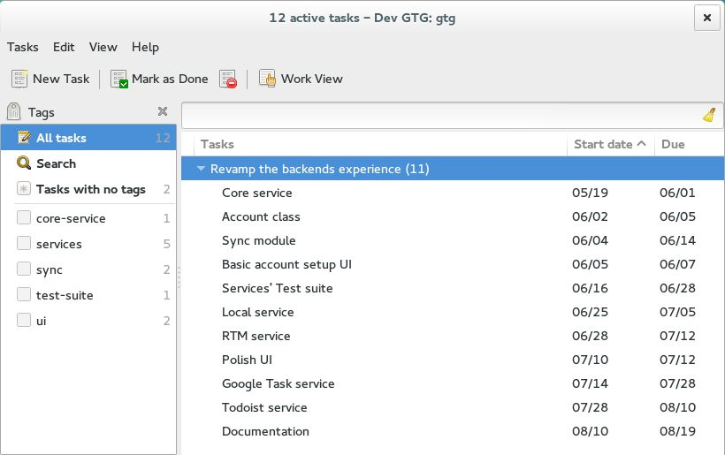

# Getting Things GNOME!: Revamp the backends' experience

*By [Parth Panchal](https://wiki.gnome.org/ParthPanchal)*

Mentor: [Nimit Shah](https://wiki.gnome.org/NimitShah)

## Abstract

-   The status quo of [Getting Things Gnome](../../../)
    ([GTG](http://gtgnome.net/)) heavily depends on generic backend &
    local xml database for different third party services. The class
    generic backend is inherited by backends for different services.
    This makes it quite difficult to add new services independent of
    generic backend, and maintain the core modules, including generic
    backend, independent of backend service sub classes.

    My project aims to introduce several features that make GTG not only
    developer friendly but also user friendly. These include detaching
    backend services from the generic backend such that new & customized
    services can be added easily, and also improvements in
    synchronization that will provide flexibility to users.

## Getting Things Done

- 

## For beta testers

- Follow the following steps to setup a debug environment.
  ```
     1 mkdir gtg-services
     2 cd gtg-services
     3 git clone https://github.com/partp/gtg-services.git
     4 git clone https://github.com/getting-things-gnome/liblarch.git
     5 cd gtg
     6 ./scripts/debug.sh
  ```

- Test test test & please do [contact](https://wiki.gnome.org/ParthPanchal) me if you
  encounter any bug.

## Links

- [Project details](https://www.google-melange.com/gsoc/project/details/google/gsoc2014/prth/5733935958982656/)
- [Project Blog](http://prthp.wordpress.com)
- [GTG mirror](http://www.github.com/partp/gtg-services/) on
  [Github](http://www.github.com/partp/)

