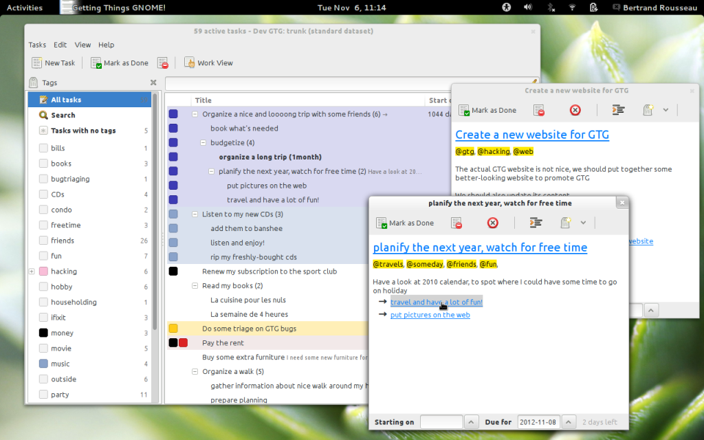

# Geolocalized Tasks Plugin

## What is Getting Things Gnome! ?

Getting Things Gnome! (GTG) is an organizer for the GNOME desktop
environment, focusing on usability and ease of use. GTG manages your
to-do items easily, complete with tags and nested subtasks.

Using GTG is easy: You can create new "Tasks", to organize what you have
to do. Sometimes, you need to finish something first before being able
to accomplish your task. For that, we have "Subtasks". The purpose of
subtasks is to cut down a task in smaller subtasks that are easier to
achieve and to track down.

You can use "tags", to sort your tasks. A tag is a simple word that
begins with "@".

If you press the "Work View" button, only actionable tasks will be
displayed in your list. What is an actionable task? It's a task you can
do directly, right now.

GTG also has the ability to add plugins to extend its core
functionality.

One of the plugins is **Geolocalized Tasks Plugin**

## What is this plugin for ?

A lot of us have to go to different places throughout the day. We need
to go to office, attend classes, buy something at the supermarket etc.
If you use one to-do list for all the things to do, it can become
cluttered, showing all your tasks at once and making you less
productive. So, you certainly want to see only those which you can do at
the place you are right now

- For eg: - When you are in your office looking at the things to do
  today, wouldn't you want that "Feed the cat!", "Put the baby to
  sleep" be shown only when you've returned home ?

Thats where this plugin comes into picture. Through this plugin, you can
set locations to your tasks and tags from a map.

### How ?

Suppose you have 3 types of tasks - to do at home, at office, and things
to buy from the market.

Open a task -

Set a location,

thats it!

- Now you can configure GTG to show only the list of items to buy when
  you are at the market. When you are at home, that 'to buy' list
  won't be displayed, but the tasks you've assigned location 'home' to
  will be shown. Similarly, you can set your office location to all
  the meetings tasks so that "Feed the cat !" doesn't pop up in the
  middle of the list and irritate you

[Here's](https://www.youtube.com/watch?v=o1SnhUV9rqw) a video which
shows the original plugin in action. It shows the different ways of
assigning the location to tasks and tags

## So, what's the project ?

When the plugin was written in 2009, things were pretty different back
then. Geoclue had a python2 library, GNOME 2.26 was released, and GTG
was getting prepared to be shown to the world for the first time. Now,
geoclue has been rewritten, and since GTG now uses python3, we have to
switch to the new one compatible with it. Currently, the plugin is not
possible to activate ([bug #697870](https://bugs.launchpad.net/bugs/697870)), GUI is outdated and
needs polish.

GTG already has a plugin infrastructure and creating a simple plugin is
very easy. There's this excellent
[HowTo](2009/PaulCabido/plugin_howto) page which shows each
and every step for creating a new plugin. Also, the example plugin shown
there can be used as template for a start.

So, your task is to rewrite the plugin. Here's what you have to do -

- Come up with your own UI. You can take inspiration from the
  interface shown in the video.
- Add the ability to set locations to tasks and tags.
- Functionalities -
  - Filter tasks based on location

If you can think of other functionalities this plugin can have, I'd love
to discuss them.

## Info for applicants

- Knowledge of Python3 and GTK3 will be needed. Basic knowledge of
  [GeoClue2](http://www.freedesktop.org/wiki/Software/GeoClue/) and
  what is [libchamplain](https://projects.gnome.org/libchamplain/)
  will be helpful (Don't worry if you can't understand much. The 3
  months are more than enough to learn the basic methods that will be
  needed for this project).
- Geoclue2 will be used for getting user's location and Champlain will
  be used for displaying it on a map.

## A contribution to fill the application

A vital part of the application process is getting to understand the
technologies that are going to be used in the project. Once you get a
feel of how they work, using them isn't very difficult. It would be nice
if you played with the technologies involved. Learn how DBus works, what
is geoclue, why are we using it etc. Try to think how you can integrate
all the stuff you've just read into a working model.

- Once you have the confidence of putting it into action, make a small
  and simple prototype which fetches the location of a user and
  displays it on a map.

I'll leave the implementation details upto you. But remember, If you
have doubts at any step, or something is not working as you expect it,
I'm here to help, so don't hesitate to contact me

This is to demonstrate that you have grasped the basics and that you can
successfully combine them into something that actually works (Thats what
matters at the end, right ?). This will also convince me that you will
be willing to learn more such things during the program. When the
prototype runs, ask a developer to review the code (for code style etc.)
using launchpad or mailing-lists.

## Contact details

- [mail](http://scr.im/nikobellic)
- IRC (Nick: parin, #gtg on Gimpnet, Timezone: IST (+0530))

## Some useful links

- [General Outreach Program for Women](https://wiki.gnome.org/GnomeWomen/OutreachProgram) page
- [Details](https://wiki.gnome.org/OutreachProgramForWomen/2013/DecemberMarch) for run in December 2013-March 2014
- [Video](https://www.youtube.com/watch?v=o1SnhUV9rqw) of the work with original plugin
- [Wiki page](https://wiki.gnome.org/gtg) for Getting Things Gnome!
- [Get started](https://wiki.gnome.org/gtg/contributing) as a contributor
- [All the details](2009/PaulCabido/plugin_howto) on how to write a plugin
- [Bug Report](https://bugs.launchpad.net/gtg/+bug/932419) regarding the idea
- [Bugtracker](https://bugs.launchpad.net/gtg/) of GTG in launchpad
- [Browse GTG Code](https://code.launchpad.net/~gtg/gtg/trunk) in launchpad

