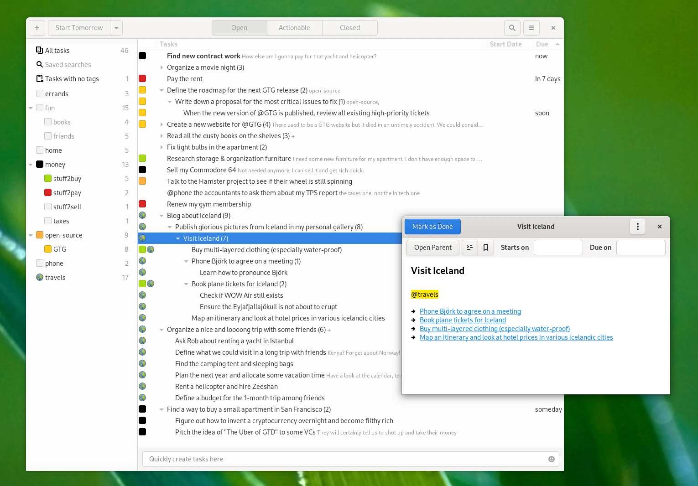

# Getting Things GNOME!

*Getting Things GNOME!* (GTG) is a personal tasks and TODO-list items organizer for the [GNOME desktop environment](https://gnome.org)
and [inspired by the "Getting Things Done" (GTD) methodology][gtd-methodology].

[gtd-methodology]: https://fortintam.com/blog/a-secret-to-productivity-for-busy-individuals-with-chaotic-contexts/

GTG is designed with flexibility, adaptability, and ease of use in mind,
so its user interface and workflow can be used as more than just "GTD"
software. GTG is intended to help you track everything you need to do
and need to know, from small tasks to large projects.

See this [amazing demo video](https://www.youtube.com/watch?v=0u1hQxsIB1M) for a tour
of GTG's features & benefits.
See also the [2020 releases teaser trailer](https://www.youtube.com/watch?v=xrZ57bP_yCY)
summarizing the project's development history.

[][gtg-mastodon]
[][gtg-twitter]

[gtg-twitter]: https://twitter.com/GetThingsGNOME
[gtg-mastodon]: https://fosstodon.org/@GettingThingsGNOME

## Features for everybody

Whether you're a [chaos warrior or a goldsmith](https://fortintam.com/blog/workers-typology-the-goldsmith-and-the-chaos-warrior/), you will appreciate:

- **A graphical user interface that accommodates many workflows**:
  The user interface can be as minimalistic or as evolved as you like,
  and can be used whether you are a GTD practicioner or not.
- **Flexible tagging system**: tags can be batch-tagged/untagged, can
  be hierarchical or not, can have an assigned color and/or emblem
  icon, and can be configured to show/hide the affected tasks in the
  workview.
- **Searches** and saved searches (with similar customizeability to
  tags)
- **Natural language parsing** and free-form task text editor
  - Supports dates like "today", "tomorrow", "thursday",
    "14", "jeudi", "now", and the [ISO 8601](https://imgs.xkcd.com/comics/iso_8601.png)
    ("YYYY-MM-DD") standard, anywhere in the UI.
  - Supports keywords like "due:" and detects @tags anywhere in
    the title or description or as you quick-create tasks (for
    example *"@phone Rob to buy a yacht in Istanbul due:Thursday
    @lifestyle @GUADEC_2008"*)
  - Quickly create multiple sub-tasks by using \* or - as if they
    were bulleted lists.
- **Projects/task dependencies** (infinite sub-tasks)
- Lets you enter detailed notes and descriptions inside a task, if you
  need to.
- **An "actionable" tasks view mode**  
  Previously called the "Workview", this only
  shows tasks that are *actionable* (tasks that do not have a start
  date set into the future, do not have dependencies/sub-tasks
  blocking them, and that are not tagged with a tag set to be excluded
  from the workview), so that you can focus on what you can act on
  "right now".
- **Quick-defer tasks** to common upcoming days, or to a custom date.
- Translated and localized in most languages of Earth (not Klingon).
- **100% Free and Open-Source**, community-driven project. Works
  offline, no backdoors, no mystery code.

You may also be interested in our old [manifesto](/Apps/GTG/manifesto),
which established the core principles behind GTG's design and feature
set.

## Features for geeks
- A super sleek, modern, native GTK user interface.
  No electron web app bullshit.
- Open, human-readable and editable XML file format. It is documented
  [here](https://github.com/getting-things-gnome/gtg/blob/master/docs/contributors/file%20format.md).
- A Python codebase that is easy to read and contribute to, and a
  welcoming community (if you want a feature, get ready to contribute
  a patch `;)`
- A plug-in architecture lets you extend the functionality of the
  program beyond conventional usecases.
- It even has a command-line control interface (`gtgcli`), if
  controlling a GUI with a mouse and keyboard is "too mainstream"
  for you (⌐■\_■) \...if you're hipster-enough to
  [fix](https://github.com/getting-things-gnome/gtg/issues/418)
  this feature, because it's probably broken (otherwise it wouldn't
  be cutting edge, would it?)

## Where to find us

See [GTG's GitHub repository](https://github.com/getting-things-gnome/gtg/) for
source code, development information, and bug reporting (make sure to
read the [bug reporting guidelines](https://github.com/getting-things-gnome/gtg/blob/master/docs/contributors/bug%20reporting%20and%20triaging.md)).  
*Note: there is also the general [GTG meta-project](https://github.com/getting-things-gnome) if you care about other technologies GTG interfaces with.*

Some of us [team chat](https://imgs.xkcd.com/comics/team_chat.png) on the
"[#gtg:gnome.org](https://matrix.to/#/#gtg:gnome.org)"
[Matrix][gnome-matrix] channel, mapped to the [#gnome-gtg IRC channel on irc.libera.chat](irc://irc.libera.chat/gnome-gtg), to
facilitate development-related discussions and coordination; feel free
to join and hang around, but don't expect 24/7 tech support there (use
our issue tracker instead, unless you're coming there to
collaboratively troubleshoot something to facilitate a report on the
issue tracker).

[gnome-matrix]: https://handbook.gnome.org/get-in-touch/matrix.html

### Where to be notified about the project's news

You can follow us on [Twitter][gtg-twitter] and
[Mastodon][gtg-mastodon] (in
addition to blog posts on [Planet
GNOME](https://planet.gnome.org) where [Jeff\'s blog posts about
GTG](https://fortintam.com/blog/tag/gtg/) appear). You can
subscribe to Jeff\'s announcements mailing list (explanation/details
[here](https://fortintam.com/blog/2019-starting-an-email-list/))
to be notified in the mail about major news & updates (roughly 1 to 5
emails per year).

## Donating
- [Diego](/januz) welcomes donations [through Liberapay](https://liberapay.com/Januz/)
  and [through GumRoad](https://diegogangl.gumroad.com/l/xKJKx). Please
  consider sponsoring his work this way so that he can allocate more
  time to maintaining GTG!
- [Jeff](/JeffFortin) does not accept donations for
  himself (though he welcomes marketing-related business)

## Documentation!

<!-- Crickets -->

### For everybody

- [Downloading and installing GTG](/Apps/GTG/install)
- [Manifesto](/Apps/GTG/manifesto): core principles behind GTG\'s
  design and feature set
- [User manual](https://fortintam.com/gtg/user_manual/) (online version)  
  How to get started and use GTG, FAQs (frequently asked questions),
  syntax, and various tips and tricks for advanced use.
  This user manual is also available offline, directly from the
  application's main menu button.
- [Press coverage](/Apps/GTG/Press): positive things the press has
  said about GTG
- [History of GTG releases](/Apps/GTG/release_names)
- [Roadmap](/Apps/GTG/Roadmap): what are the big orientations of the
  project?
- [Bug reporting and triaging](https://github.com/getting-things-gnome/gtg/blob/master/docs/contributors/bug%20reporting%20and%20triaging.md)

### For new contributors

- [Contributing](https://github.com/getting-things-gnome/gtg/blob/master/CONTRIBUTING.md):
  do you want to help GTG? Start here.
- For programmers/developers: see the various pieces of documentation
  in
  [docs/contributors](https://github.com/getting-things-gnome/gtg/tree/master/docs/contributors)
  folder, including but not limited to:
  - Our [coding style & \"best
    practices\"](https://github.com/getting-things-gnome/gtg/blob/master/docs/contributors/coding%20best%20practices.md)
  - [Git workflow tips &
    tricks](https://github.com/getting-things-gnome/gtg/blob/master/docs/contributors/git%20workflow%20tips.md)
  - Tips on [profiling
    GTG](https://github.com/getting-things-gnome/gtg/blob/master/docs/contributors/profiling%20GTG%20for%20performance.md)
    to investigate performance issues (if any)
  - Our [plugin development
    guide](https://github.com/getting-things-gnome/gtg/blob/master/docs/contributors/plugin%20development%20guide.md)
    (might be a bit outdated, patches welcome)
  - Our DBus API (to be able to remotely control GTG; this
    documentation might be outdated, patches welcome)
  - Test suite documentation
  - ...and much more!
- Information on
  [LibLarch](https://wiki.gnome.org/Projects/liblarch): our
  library for displaying tasks in GTK tree widgets with extreme
  flexibility
- [Becoming a developer or maintainer](https://github.com/getting-things-gnome/gtg/blob/master/docs/contributors/becoming%20a%20developer%20or%20maintainer.md):
  if you want to be involved much more often, with bigger challenges
- [Plugin Ideas](/Apps/GTG/Pluginideas): Concepts we find interesting,
  but might not want to do right now.
- The [GUADEC 2020 presentation](https://www.youtube.com/watch?v=TfGY3f3xZ_A)
  explaining how we successfully revived this project, and how we are
  managing it going forward.

### For maintainers and crazy developers

- [Release process](https://github.com/getting-things-gnome/gtg/blob/master/docs/contributors/release%20process%20and%20checklist.md): how to make a new GTG release?
- [Plug-ins](/Apps/GTG/plugins): List of third party plugins.
- [Data model](/Apps/GTG/DataModel): notes on how GTG represents tasks
  & similarities to other tools. This was accurate from 2010 to
  2013-2015, but may change in 2020 and need to be re-documented.
- Old design documents, kept only for [hysterical
  raisins](https://en.wikipedia.org/wiki/Backward_compatibility)
  as of 2020:
  - [Design](/Apps/GTG/Design): discussions, mockups and other
    brainstorming work regarding GTG's UI as a whole
  - [User stories](/Apps/GTG/UserStories): plain-language
    specifications for how users (and developers!) should experience
    GTG.
  - [Proposals & Blueprints](/Apps/GTG/blueprints): old "new"
    features proposals that were under discussion among the previous
    maintainers
   - [Feature requests](/Apps/GTG/feature_requests) that are
     typically already in the GTG bug tracker or implemented
   - [Historical notes on the port to GTK3](/Apps/GTG/GTK3Port)
- [List of Google Summer of Code projects related to GTG](/Apps/GTG/Google_Summer_of_Code)

