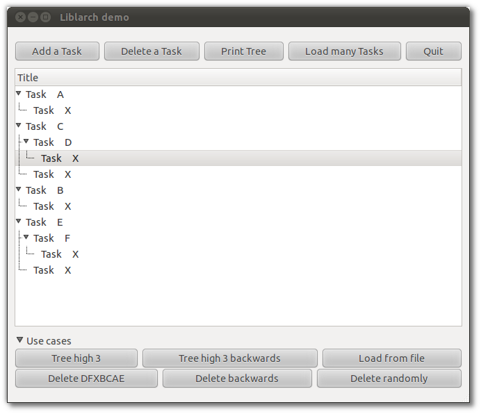

# Test cases for LibLarch

For purpose of rewriting parts of [LibLarch](index), there is a
small demo at
[lp:~izidor/gtg/liblarch-demo](https://code.launchpad.net/~izidor/gtg/liblarch-demo).
It contains liblarch and liblarch-gtk code, unittests and a GUI
application for experimenting. A screenshot of the demo application:

The following list of behavior defined by use cases is required:

## Test case #1

-   run unit tests

**Expected result:** Every unit test passes.

## Test case #2

-   Load situation form file *example-trees/delete-randomly*

-   Select all tasks (*\<CTRL> + A*)

-   Press *Delete randomly*

**Expected result:** The operation is completed in a reasonable time and
without errors in the console (compare by deleting by *Delete
backwards*)

**Actual result:** Many tracebacks in console, deleting takes a long
time.

## Test case #3

-   Load situation form file *example-trees/test_suite*

-   Select any *Task X* and delete it

**Expected result**: No warning and the resulting tree like this one:

    ==================== Tree ====================
    root
     A
     C
      D
     B
     E
      F
    ==============================================

## Test case #4

-   Load situation form file *example-trees/test_suite*

-   Select any parent of *Task X* and delete it

**Expected result:** No warnings and preserve consistency of the tree

## Test case #5

-   Load situation form file *example-trees/test_suite*

-   Press the button *Delete DFXBCAE*

**Expected result:** No warnings, the result tree is empty.

**Actual result:**

    /home/iyo/projekte/liblarch-demo/GTG/gtk/liblarch_gtk/treemodel.py:403: GtkWarning: _gtk_rbtree_reorder: assertion `tree->root->count == length' failed 
      f(*args)

## Test case #6

-   Load situation form file *example-trees/test_suite*

-   Select any task (X or not X) and press *Tree high 3 backwards*

**Expected result:** added to tree and preserved consistency of the tree

**Actual result:** many warnings, e.g

    ** (main.py:29964): CRITICAL **: pygtk_generic_tree_model_get_value: assertion `VALID_ITER(iter, tree_model)' failed

    ** (main.py:29964): CRITICAL **: pygtk_generic_tree_model_get_value: assertion `VALID_ITER(iter, tree_model)' failed

    ** (main.py:29964): CRITICAL **: pygtk_generic_tree_model_iter_children: assertion `parent == NULL || parent->stamp == PYGTK_GENERIC_TREE_MODEL(tree_model)->stamp' failed

## Test case #6

-   Load situation form file *example-trees/test_suite*

-   Select any task (X or not X) and press *Tree high 3 backwards*

**Expected result:** added to tree and preserved consistency of the tree

**Actual result:** many warnings, e.g

    ** (main.py:29964): CRITICAL **: pygtk_generic_tree_model_get_value: assertion `VALID_ITER(iter, tree_model)' failed

    ** (main.py:29964): CRITICAL **: pygtk_generic_tree_model_get_value: assertion `VALID_ITER(iter, tree_model)' failed

    ** (main.py:29964): CRITICAL **: pygtk_generic_tree_model_iter_children: assertion `parent == NULL || parent->stamp == PYGTK_GENERIC_TREE_MODEL(tree_model)->stamp' failed

## Test case #7

-   Load situation form file *example-trees/cycle*

**Expected result:** A traceback:

    Traceback (most recent call last):
      File "./main.py", line 504, in load_from_file
        parent_node.add_child(child)
      File "/home/iyo/projekte/liblarch-demo/GTG/tools/liblarch/tree.py", line 600, in add_child
        toreturn = self.new_relationship(self.get_id(),node_id)
      File "/home/iyo/projekte/liblarch-demo/GTG/tools/liblarch/tree.py", line 484, in new_relationship
        return self.tree.new_relationship(par,chi)
      File "/home/iyo/projekte/liblarch-demo/GTG/tools/liblarch/tree.py", line 233, in new_relationship
        "between %s and %s" %(parent_id,child_id))
    Exception: Cannot build circular relationshipbetween Child and Parent

-   Press button *Print Tree* (to see how liblarch see the tree)

**Expected result:** print the same tree which is shown in
liblarch_widget

**Actual result:** many parent, child nodes and ended by a traceback
*RuntimeError: maximum recursion depth exceeded in cmp*

    ... shorten ...
      File "/home/iyo/projekte/liblarch-demo/GTG/tools/liblarch/tree.py", line 427, in _print_from_node
        self._print_from_node(cur_node, prefix)
      File "/home/iyo/projekte/liblarch-demo/GTG/tools/liblarch/tree.py", line 427, in _print_from_node
        self._print_from_node(cur_node, prefix)
      File "/home/iyo/projekte/liblarch-demo/GTG/tools/liblarch/tree.py", line 427, in _print_from_node
        self._print_from_node(cur_node, prefix)
      File "/home/iyo/projekte/liblarch-demo/GTG/tools/liblarch/tree.py", line 427, in _print_from_node
        self._print_from_node(cur_node, prefix)
      File "/home/iyo/projekte/liblarch-demo/GTG/tools/liblarch/tree.py", line 427, in _print_from_node
        self._print_from_node(cur_node, prefix)
      File "/home/iyo/projekte/liblarch-demo/GTG/tools/liblarch/tree.py", line 427, in _print_from_node
        self._print_from_node(cur_node, prefix)
      File "/home/iyo/projekte/liblarch-demo/GTG/tools/liblarch/tree.py", line 427, in _print_from_node
        self._print_from_node(cur_node, prefix)
      File "/home/iyo/projekte/liblarch-demo/GTG/tools/liblarch/tree.py", line 427, in _print_from_node
        self._print_from_node(cur_node, prefix)
      File "/home/iyo/projekte/liblarch-demo/GTG/tools/liblarch/tree.py", line 427, in _print_from_node
        self._print_from_node(cur_node, prefix)
      File "/home/iyo/projekte/liblarch-demo/GTG/tools/liblarch/tree.py", line 427, in _print_from_node
        self._print_from_node(cur_node, prefix)
      File "/home/iyo/projekte/liblarch-demo/GTG/tools/liblarch/tree.py", line 427, in _print_from_node
        self._print_from_node(cur_node, prefix)
      File "/home/iyo/projekte/liblarch-demo/GTG/tools/liblarch/tree.py", line 427, in _print_from_node
        self._print_from_node(cur_node, prefix)
      File "/home/iyo/projekte/liblarch-demo/GTG/tools/liblarch/tree.py", line 427, in _print_from_node
        self._print_from_node(cur_node, prefix)
      File "/home/iyo/projekte/liblarch-demo/GTG/tools/liblarch/tree.py", line 427, in _print_from_node
        self._print_from_node(cur_node, prefix)
      File "/home/iyo/projekte/liblarch-demo/GTG/tools/liblarch/tree.py", line 427, in _print_from_node
        self._print_from_node(cur_node, prefix)
      File "/home/iyo/projekte/liblarch-demo/GTG/tools/liblarch/tree.py", line 427, in _print_from_node
        self._print_from_node(cur_node, prefix)
      File "/home/iyo/projekte/liblarch-demo/GTG/tools/liblarch/tree.py", line 427, in _print_from_node
        self._print_from_node(cur_node, prefix)
      File "/home/iyo/projekte/liblarch-demo/GTG/tools/liblarch/tree.py", line 427, in _print_from_node
        self._print_from_node(cur_node, prefix)
      File "/home/iyo/projekte/liblarch-demo/GTG/tools/liblarch/tree.py", line 427, in _print_from_node
        self._print_from_node(cur_node, prefix)
      File "/home/iyo/projekte/liblarch-demo/GTG/tools/liblarch/tree.py", line 426, in _print_from_node
        cur_node = node.get_child(c)
      File "/home/iyo/projekte/liblarch-demo/GTG/tools/liblarch/tree.py", line 583, in get_child
        if self.tree and self.tree.has_node(node_id) and node_id in self.children:
      File "/home/iyo/projekte/liblarch-demo/GTG/tools/liblarch/tree.py", line 339, in has_node
        return (node_id in self.nodes)
    RuntimeError: maximum recursion depth exceeded in cmp

## Test case #8

Same as *Test case #7* but load *example-trees/cycle2* instead. It is
contains indirect recursion (A->B, B->A).
