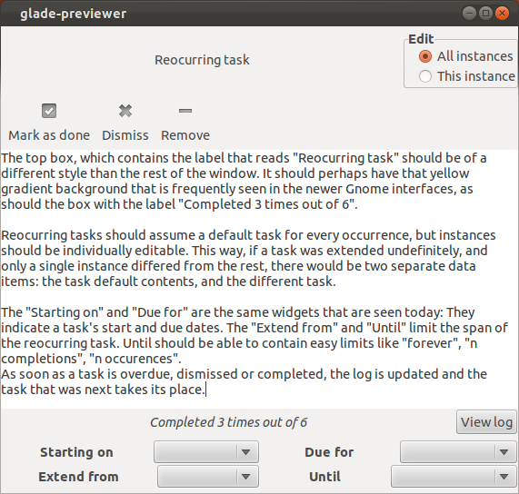

# Repeated tasks

GTG should be updated to include reoccurring tasks. Reoccurring tasks
are a natural part of task management (and life ;). It should be easy
for a user to specify that tasks are reoccurring and at what frequency.

The following task frequencies should be supported:

- Daily, shown as: "daily" or "day"
- Particular day of the week, shown as: "sunday", "sun", "monday",
  "mon", "tuesday", "tue", "wednesday", "wed", "thursday", "thu",
  "friday", "fri", "saturday", "sat"
- Particular day of the month, shown as:
  - 1 through 31, to indicate the day of month
  - Numbers entered should be updated with suffix, e.g. 1 become
    "1st", 2 becomes "2nd"
- **Annually, shown as: ??**

Task frequencies should be altered using (allowable) combinations of
prefixes and suffixes.

- Complex prefixes
  - First (e.g. "first monday")
  - Second (e.g. "second tuesday")
  - Third (e.g. "third wed")
  - Fourth (e.g. "fourth sunday")
  - Last (e.g. "last fri")
  - Every Other (e.g. "every other friday")
- Complex unions:
  - Using a comma (',') to link multiple frequencies. (e.g. "mon,
    wed, fri" or "first mon, third mon")
- Complex suffixes:
  - Days (e.g. "10 days", which means the task reoccurs every 10
    days.)
  - After (e.g. "10 after", which means the task reoccurs 10 days
    after last completed or dismissed)

## Implementation: Task Window

The Task window should be updated to include a third field in the bottom
status bar, to the right of "Starting on" and "Due for". This new field
should be labeled "Reoccurs" and have an editable text field containing
the present setting. Examples of the text present include:

Friday  
20th  
5 Days  

Ideally, but not required, the text displayed should use proper
capitalization and be expanded regardless of how it was entered by the
user. That is, if the user enters "every other mon" the UI will display
"Every Other Monday".

**Task Window Mock-up:**

## Implementation: Quick Add Bar

The Quick Add bar should allow any of the frequency text and modifiers
above. The text "every:" should be used to indicate reoccuring task
frequency like "tags:" is used to list tags.

OPEN QUESTION: Since the "every:" text may contain spaces, e.g. "last
friday", what is the best way to enter it? Require the user to enter
with quoted spaces? Require that "every:" be added at the end of the
line?

\<mock-up screen shot>

## Application Behaviors

When the "Reoccurs" field is in use, the "Due on" field should be
uneditable, and should contain the calendar date when the current
instance of the task is due. For example, if on Saturday, 2012-02-04, I
have a reoccurring task due on "Monday", the "Due for" field should
contain "2012-02-06". Once the "Reoccurs every" field is empty, the "Due
for" field should then be directly editable again.

When a reoccuring task is completed via the "Mark as done" function, a
new instance of the task should be created and the current instance
should be marked as "done" such that it appears in the "closed tasks
pane". This new instance will be identical to the current instance with
the "due for" field set to the next due date. All notes inside the task
and tags shall be copied to the new task instance.

Dismissal of a reoccurring task shall behave identical to task
completion above, only the old task instance shall be marked "dismissed"
and not "done".

When a reoccurring task is deleted, the task shall be deleted with no
new task instances being created. This is how a series of reoccurring
tasks shall be ended.

## GNOME design group

After having a set of design mockups, we can ask GNOME Design Group
for their opinion and feedback (e.g. through #gnome-design on IRC).

We should set design goals and read [design strategies](https://live.gnome.org/Design/HIG/DesignStrategies).

## Alternative approaches

- delegate repeated tasks to Google Calendar backend
- [smart add](https://bugs.launchpad.net/gtg/+bug/671245)

