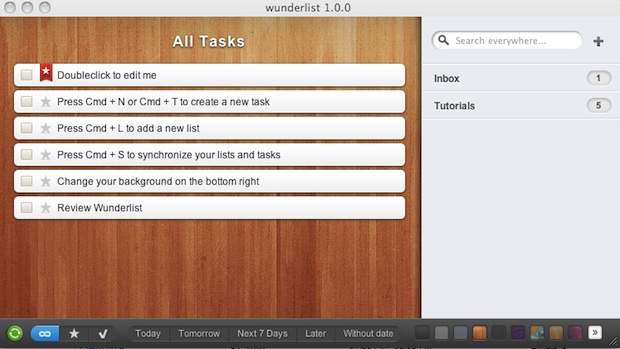
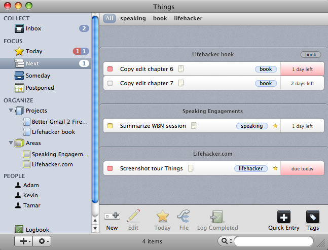
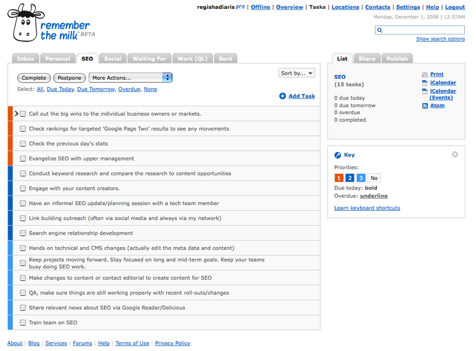
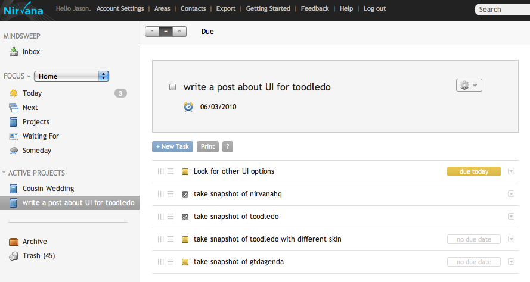

# Potential TODO List

To-Do and Task Manager.

## Participants

Design: alba.

## Status

- [ ] Needs design
- [x] Design in progress
- [ ] Needs implementation
- [ ] Implementation in progress
- [ ] Stable

### Design Goals

- Redesign GTG to fit the Gnome Core Apps HIG requirements
- Reducing the program to one top-level window
- Eradicate some Usability Flaws

## Relevant Art

### Wunderlist

### Things

### Remember the Milk

### Nirvana

## Tentative Design

## Discussion

- [GTG Design page](design)

## See Also

- 

